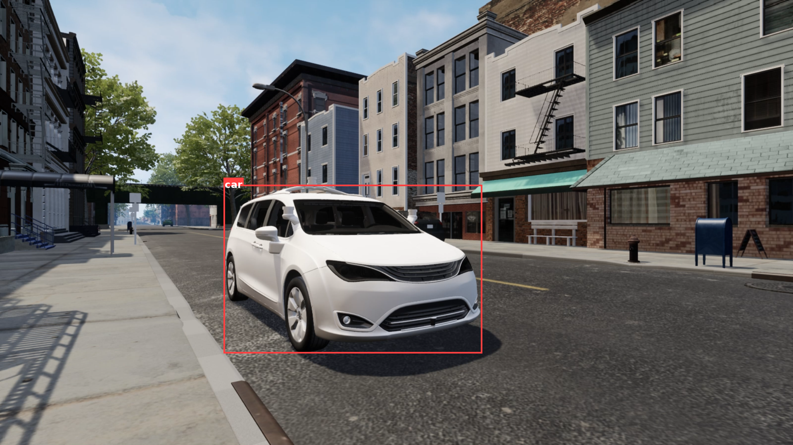

# tt-locate-anything

End-to-end port of NVIDIA
[LocateAnything-3B](https://huggingface.co/nvidia/LocateAnything-3B) — an Eagle-family
visual-grounding / open-vocabulary detection VLM — to Tenstorrent **tt-metal**
(tt-nn + tt-metallium), running on a single Blackhole **p150a** chip.

The model is a **MoonViT-SO-400M** vision tower + a 2×2 patch merger + an `mlp1`
projector feeding a **Qwen2.5-3B-Instruct** language model with an extended
detection vocabulary. Given an image and a free-text query ("locate all the
instances that match …"), it emits `<ref>label</ref><box><x1><y1><x2><y2></box>`
token sequences that decode to pixel boxes.

This repository contains:

- a TT-NN MoonViT vision tower + projector (`locate_anything/tt/vision.py`), run
  as one metal trace with the 2×2 patch merger on device,
- a thin `Transformer` subclass that drives the Qwen2.5-3B backbone from
  pre-merged image+text embeddings (`locate_anything/tt/model_la.py`), with the
  vision→LLM merge, a traced 36-layer prefill and a one-row first-token readback,
- the **fused-path knob family** (`TT_FUSED`, `LA_FUSED_*`) and the torch-only
  pieces behind it — exact 0/1 merge tables, padding rule, stale-token guard,
  program-config validators (`locate_anything/tt/fused.py`),
- the end-to-end greedy pipeline the benchmark, the demo and the HF serving
  package share (`locate_anything/tt/pipeline.py`),
- an experimental on-device **Parallel Box Decoding** (MTP) decoder
  (`locate_anything/tt/mtp.py`),
- a self-contained torch-CPU reference + golden/oracle builders
  (`locate_anything/reference/`),
- the one-file overlay of tt-metal's `tt_transformers` MLP that spills the decode
  `w1`/`w3` outputs to DRAM so the BFP8 LLM fits L1 on one chip
  (`models/tt_transformers/tt/mlp.py`),
- pytest suites for per-stage vision PCC, an end-to-end baseline benchmark with a
  PCC accuracy gate, an MTP fidelity test, two image-in / boxes-out demos, and a
  torch-only host test of the fused-path reformulations (no device needed).

`DEVICE_VALIDATION.md` is the plan and the measured results of the 2026-09-13
device validation of the fused paths on a p150a (per-lever exactness, PCC, ms).

Unlike a from-scratch ttnn model, **LocateAnything's LLM backbone reuses
tt-metal's own model libraries** — `models.tt_transformers` (the stock Qwen2.5
`Transformer` / `Generator` / paged-KV `Attention` / `MLP`) and
`models.demos.qwen25_vl` (vision-token merge + prefill prep). So this repo is an
*overlay* on a tt-metal checkout, not a standalone reimplementation: point Python
at a built tt-metal and run from here. See **Environment setup**.

---

## Demo

Greedy autoregressive decode and the experimental hybrid-MTP path, both running
the full pipeline (MoonViT vision + Qwen2.5-3B LLM) on one Blackhole p150a.
Reproduce with `pytest locate_anything/tests/test_demo_visualize.py` (AR) or
`test_demo_mtp_visualize.py` (MTP); query and image are set via `LA_QUERY` /
`LA_IMAGE`.

| Input (`media/demo_input.png`) | AR decode (`media/demo_ar.png`) | Hybrid-MTP (`media/demo_mtp.png`) |
|:---:|:---:|:---:|
|  |  |  |

---

## Contents

```
locate_anything/
├── reference/
│   ├── la_inputs.py             # image preprocess + chat-template build (no cv2/lmdb/decord)
│   ├── extract_llm_checkpoint.py# LocateAnything-3B → vanilla Qwen2.5-3B HF dir for tt_transformers
│   ├── run_reference.py         # HF torch-CPU golden dump (vision + prefill logits) → golden.pt
│   ├── mtp_cpu_loop.py          # correct bsz=1 hybrid/fast MTP loop (torch CPU); the device blueprint
│   └── mtp_oracle.py            # picks a box-yielding (image,query); dumps MTP oracle → mtp_oracle.pt
├── tt/
│   ├── vision.py                # TT-NN MoonViT-SO-400M + mlp1 projector (bf16 / HiFi4); one metal trace, device patch merger
│   ├── model_la.py              # LATransformer: Qwen2.5-3B with embeds-driven prefill; fused device merge + prefill trace
│   ├── fused.py                 # TT_FUSED / LA_FUSED_* knobs (read once at build), exact 0/1 tables, validators (torch only)
│   ├── pipeline.py              # LocateAnythingPipeline: build, warm-up, trace capture, image+query → boxes (greedy AR)
│   └── mtp.py                   # MTPDecoder: on-device Parallel Box Decoding (experimental)
└── tests/
    ├── test_vision.py           # incremental vision PCC vs golden (gate ≥ 0.99)
    ├── bench_locate_anything.py # baseline benchmark: prefill PCC + greedy AR decode + metrics
    ├── test_fused_host.py       # torch-only host tests of the fused-path reformulations (no device)
    ├── test_mtp.py              # device-MTP vs torch-CPU-MTP logit PCC (fidelity)
    ├── test_demo_visualize.py   # image → boxes (greedy AR) visualization
    └── test_demo_mtp_visualize.py # image → boxes (hybrid MTP) visualization
models/tt_transformers/tt/
└── mlp.py                      # overlay of tt-metal's MLP: decode w1/w3 spilled to DRAM (fits L1 on one p150a)
scripts/
└── download_weights.sh         # pull LocateAnything-3B + extract the Qwen2.5-3B LLM dir
conftest.py                     # loads tt-metal's device fixtures (mesh_device, device_params, …)
DEVICE_VALIDATION.md            # fused-path device validation: plan, gates, measured results (2026-09-13)
```

This repo does **not** vendor the tt-metal monorepo, the model weights, or the
torch goldens. The first come from your tt-metal build; the second from the Hugging
Face Hub; the third are generated locally.

---

## Environment setup

1. **Build tt-metal** with its Python bindings (and Tracy if you plan to profile).
   Instructions: https://github.com/tenstorrent/tt-metal. This is the source of
   `ttnn`, `models.tt_transformers`, and `models.demos.qwen25_vl`, all of which
   this repo imports directly.

2. **Install the Python deps** (the tt-metal `python_env` already has most of
   them). A working set on top of `ttnn`:

   ```bash
   pip install torch torchvision transformers safetensors pillow numpy loguru \
               huggingface_hub matplotlib
   ```

   `torch` can be CPU-only — it is used for the reference, host embedding lookup,
   the vision-token merge, and host argmax sampling.

3. **Point Python at tt-metal** and set the runtime env. The single most important
   variable is `TT_VISIBLE_DEVICES`, which constrains UMD to a single chip:

   ```bash
   export TT_METAL_HOME=/path/to/tt-metal
   export ARCH_NAME=blackhole
   export MESH_DEVICE=N150                  # single-chip 1x1 mesh
   # This repo FIRST: models/tt_transformers/tt/mlp.py must shadow the stock file (see below)
   export PYTHONPATH=$PWD:$TT_METAL_HOME:$TT_METAL_HOME/ttnn:$TT_METAL_HOME/tools
   # Run on exactly ONE Blackhole chip. Set BOTH so UMD opens only this chip:
   export TT_VISIBLE_DEVICES=0
   export TT_METAL_VISIBLE_DEVICES=0
   ```

   `conftest.py` re-uses tt-metal's own pytest fixtures and hooks (so
   `mesh_device` / `device_params` / `reset_seeds` behave identically to running
   inside the tt-metal tree); it requires `TT_METAL_HOME` to be set.

   **`mlp.py` overlay.** The stock `models/tt_transformers/tt/mlp.py` fails on a
   single p150a at the first decode step (`Statically allocated circular buffers …
   clash with L1 buffers`, `w3` linear). `models/tt_transformers/tt/mlp.py` in this
   repo is that file from tt-metal main `8b98410e730` with one change: in decode
   mode the `w1` and `w3` outputs are moved to DRAM before the next matmul. Because
   `models/` is a namespace package in the tt-metal tree, putting this repo before
   `$TT_METAL_HOME` on `PYTHONPATH` is enough for the overlay to win; check with
   `python -c "import models.tt_transformers.tt.mlp as m; print(m.__file__)"`. The
   port was validated on that tt-metal revision (`v0.78.0-dev20260820`); on another
   revision, diff the overlay against your tree's file before relying on it.

4. **Download the weights** and extract the LLM directory:

   ```bash
   bash scripts/download_weights.sh
   # → LocateAnything-3B snapshot (LA_MODEL_PATH) + extracted Qwen2.5-3B (HF_MODEL)
   export HF_MODEL=~/.cache/locate_anything/LA-Qwen2.5-3B
   ```

5. **Generate the torch-CPU goldens** the PCC tests compare against:

   ```bash
   python locate_anything/reference/run_reference.py --in-token-limit 1024  # → golden.pt
   python locate_anything/reference/mtp_oracle.py    --in-token-limit 1024  # → mtp_oracle.pt (MTP test only)
   ```

---

## Running the tests

```bash
# 1) Vision tower per-stage PCC vs the torch golden (gate ≥ 0.99 on vit_proj)
pytest -svq locate_anything/tests/test_vision.py

# 2) Baseline benchmark: prefill PCC vs golden + greedy AR decode + metrics
#    Prints greppable: inference_speed=, accuracy=, peak_dram=, decode_tok_s=, vision_ms=, prefill_ms=
pytest -svq locate_anything/tests/bench_locate_anything.py

# 3) Experimental MTP (Parallel Box Decoding): device-MTP vs torch-CPU-MTP logit PCC
pytest -svq locate_anything/tests/test_mtp.py

# 4) Image → boxes demos (set LA_QUERY / LA_IMAGE / LA_OUT)
LA_QUERY="car" pytest -svq locate_anything/tests/test_demo_visualize.py        # greedy AR
LA_QUERY="car" pytest -svq locate_anything/tests/test_demo_mtp_visualize.py    # hybrid MTP

# 5) Tracy-profiled run (requires a Tracy-enabled tt-metal build)
python -m tracy --no-runtime-analysis --collect-noc-traces \
    --profiler-capture-perf-counters=all -v -r -o ./tracy_out \
    -m pytest locate_anything/tests/bench_locate_anything.py

# 6) Fused-path host tests: torch only, no device, no ttnn tensors (14 tests).
#    --noconftest keeps tt-metal's device fixtures out of a host run.
pytest --noconftest -q locate_anything/tests/test_fused_host.py
python locate_anything/tests/test_fused_host.py          # same, without pytest

# 7) Legacy (2026-09-12) device graph, bit for bit, for any of the above
TT_FUSED=0 pytest -svq locate_anything/tests/bench_locate_anything.py
```

`bench_locate_anything.py` env knobs: `LA_PREC` (`accuracy` default — BF16
attention + BFP8 MLP — or `bfp8attn`), `LA_TRACE` (`1` default, trace-replay
decode), `LA_VISION` (`device` default, or `golden` to feed the CPU vision golden
and isolate LLM PCC). `TT_FUSED` (default on; `0` = legacy) is read once at model
build: in `test_vision.py` / `bench_locate_anything.py` / the demos it selects the
vision tower's fused ops (run eagerly there, bit-identical to the legacy graph in the
default configuration), while the full fused request flow — vision trace, device
vision→LLM merge, prefill trace, on-device greedy argmax — lives in
`LocateAnythingPipeline` (see **Fused device paths** below for the per-stage knobs).

`locate_anything/tt/pipeline.py` is the end-to-end recipe (build, warm-up, trace
capture, image + query → boxes) that the HF serving package runs; the benchmark and
demo import their model-construction and box-parsing helpers from it. Nothing in it
opens a device or touches weights at import time. Host-side use:

```python
import os
from PIL import Image
from locate_anything.reference import la_inputs
from locate_anything.tt import pipeline as P

dev = P.open_mesh_device((1, 1), trace_region_size=160_000_000)   # 50 MB suffices with TT_FUSED=0
pipe = P.LocateAnythingPipeline(dev, la_inputs.find_model_path(), os.environ["HF_MODEL"], grid_hw=(24, 44))
pipe.warmup()                                     # run 1 compiles + captures decode; vision/prefill traces follow
out = pipe.run(Image.open("media/demo_input.png"), "car")
print(out["raw_text"], out["detections"], out["timing_ms"], out["fused"])
```

---

## Results

All numbers are for the fixed golden workload (one image + one query) on a single
p150a, **everything on device** (MoonViT vision + Qwen2.5-3B LLM), warm-measured
with trace-replay decode. The accuracy gate is **PCC ≥ 0.99** against the torch-CPU
reference. Re-measured on 2026-09-13 during the device validation of the fused paths
(`DEVICE_VALIDATION.md`, "Results") against goldens regenerated with the port's own
torch 2.7.1 / transformers 4.53.0 (`run_reference.py --in-token-limit 1024`); the
golden regeneration is why the accuracy rows moved from the 2026-09-12 values
(0.9928 → 0.9919 full, 0.9911 → 0.9924 projector) — the legacy device numerics did
not change, and the default fused configuration reproduces them bit for bit
(`torch.equal` on the projector output, identical PCC to every digit).

### Accuracy (PCC vs torch-CPU golden, `test_vision.py` 26×42 grid / `bench_locate_anything.py`)

| Stage | PCC (default = `TT_FUSED=0`) |
|---|---:|
| Vision `patch_embed`                  | 0.99999 |
| Vision `encoder_out` (27 blocks)      | 0.9855 |
| Vision `vit_proj` (after `mlp1`)      | 0.9924 |
| LLM prefill last-token logits (`LA_VISION=golden`) | 0.9915 |
| **Full on-device logits (vision→LLM)**| **0.9919** |

On the served 24×44 grid (`media/demo_input.png`) the projector PCC is 0.9958 and the
full-pipeline PCC 0.9935. Demo image + `car` decodes to
`<ref>car</ref><box><282><414><606><794></box>` on both paths; the HF torch-CPU
reference with the same torch/transformers gives `<282><414><607><797>` (IoU 0.989),
so the port's box is the legacy device string, not an exact match of the reference.

The vision encoder is computed in bf16 with HiFi4 (fp32 dest accumulate); the
golden is taken in fp32 so the bf16 port has a fair high-precision target (a 27-layer
bf16 tower drifts on its own). The `mlp1` LayerNorm/GELU lifts the projector PCC
above the encoder's. The LLM uses **BF16 attention + BFP8 MLP weights**; BFP8 MLP is
required for the ≥0.99 gate (BFP4 MLP only reaches ~0.935), and the decode `w1`/`w3`
outputs are spilled to DRAM (`models/tt_transformers/tt/mlp.py` overlay) so the BFP8
weight-stream circular buffers fit L1 on one chip.

### Performance (warm, demo image + `car`, 10 generated tokens; 2026-09-13)

Served `/predict` medians over 100 warm requests, server-side `timing_ms`
(`DEVICE_VALIDATION.md` §5, shipped image with this code; batch 1):

| Metric | `TT_FUSED=0` (2026-09-12 graph) | **default (fused)** |
|---|---:|---:|
| Vision (MoonViT + `mlp1`)  | 47.6 ms | one metal trace, submitted non-blocking: 1.6 ms (the wait lands in prefill; 43.4 ms device time measured stand-alone) |
| Prefill                    | 62.5 ms | 86.3 ms incl. the vision wait (device vision→LLM merge, traced 36 layers, one-row first token) |
| Decode (10 tokens)         | 231.9 ms · 39.1 tok/s | **202.3 ms · 44.5 tok/s** (on-device greedy argmax) |
| Total, server-side         | 357.5 ms (350.7–364.6) | **304.7 ms (304.1–305.7)** |
| Client wall (HTTP)         | 0.40 s | 0.34 s |

Same request through `LocateAnythingPipeline` on the host (30 runs, median):
360.9 ms → 304.9 ms. Peak DRAM 6.55–6.56 GB in every configuration. Derived, not
measured directly: ~3.3 requests/s at the fused median vs ~2.8 on the legacy graph.
(The 2026-09-12 table read ~38 tok/s / 53 ms vision / 64 ms prefill / 2.32 frames/s
for the benchmark workload.)

Decode is **weight-bandwidth bound** (~3 GB/token streamed), not host-bound — which
is why the trace win is large and the second command queue is not; the fused paths
recover the remaining host round-trips (vision readback + host merge + embeds upload,
32×vocab logits readback per step) rather than device compute.

### Fused device paths (`TT_FUSED`)

`TT_FUSED` is read **once at model build** (`FusedConfig.from_env()` in
`locate_anything/tt/fused.py`), never per request. Unset or `1` = the fused paths;
**`TT_FUSED=0` restores the 2026-09-12 legacy graph bit for bit** (same device ops, same
order, same arguments — device-verified: strict fused output `torch.equal` to legacy,
G2 token-identical on the 3-query set). The default configuration keeps only the levers
that were shown *exact* on the device; the precision-affecting ones stay behind
sub-knobs. Per-lever verdicts (`DEVICE_VALIDATION.md` §4):

| Lever | Where | Device result | Knob (default) |
|---|---|---|---|
| A. MoonViT as one metal trace, persistent pixel input | `vision.py` `capture_trace` / `forward_device` | exact (`trace == eager`); with B/J −4.4 ms vision | `LA_FUSED_VISION_TRACE=1` |
| B. 2×2 patch merger on device (4 × 0/1 permutation matmuls + concat) | `vision.py` `_merge_device`, tables in `fused.py` | `torch.equal` to `patch_merge_host` | always on with the fused path |
| J. ROW_MAJOR pixel upload + in-graph tilize | `vision.py` `_ingest` | exact | `LA_FUSED_RM_INPUT=1` |
| K. vision→LLM merge on device (ids upload, `embd` gather, one 0/1 merge matmul) | `model_la.py` `fused_embeds_device` | `torch.equal` to the host embeds; with N −11.4 ms | `LA_FUSED_DEVICE_MERGE=1` |
| L. 36-layer prefill as one metal trace + eager norm/LM-head tail | `pipeline.capture_traces`, `LATransformer.fused_prefill_graph` | exact (tokens identical); ~0 ms measured gain, kept | `LA_FUSED_PREFILL_TRACE=1` |
| N. first token from one logits row (305 KB instead of 9.8 MB) | `LATransformer.first_token_from_logits` | exact (same bf16 row) | `LA_FUSED_SMALL_READBACK=1` |
| M. greedy argmax on device in the decode loop + stale-token guard | `pipeline.run` | −2.8 ms/token; not bit-identical to host argmax at ≤ 4-ULP near-ties on degenerate prompts (3-query G2 set identical) | `LA_FUSED_DEVICE_SAMPLING=1` |
| C. exact tile-aligned sequence (1056 rows, no 128-padding, no SDPA mask) | `fused.py` `vision_seq_pad` | −6.7 ms end to end, PCC gates pass, **demo box moves to the HF reference's** `<607><797>` | `LA_FUSED_EXACT_SEQ=0` (opt-in `1`) |
| F. SDPA program config: `96,352` chunks + exact exp | `MoonViT.sdpa_pc` | −6.4 ms end to end, full PCC 0.9929 (> legacy); same box caveat as C; `96,1056` clashes in L1 next to the LLM | `LA_FUSED_SDPA_CHUNKS=32,32`, `LA_FUSED_SDPA_EXP_APPROX=1` (opt-in `96,352` / `0`) |
| D/E. `minimal_matmul` / `dit_minimal_matmul_addcmul_fused` for the vision matmuls | `MoonViT._matmul*` | −3.6 ms vision, full PCC 0.98997 **below the gate** | `LA_FUSED_MATMUL=linear` (`minimal` dropped) |
| H. tanh GELU (reference variant) | `MoonViT._gelu` | lower PCC on both goldens | `LA_FUSED_GELU=erf` |
| I. vision working set in L1 | `MoonViT.mem` | −2.0 ms vision but full PCC 0.98952 with `linear` (not bit-identical on the padded graph) | `LA_FUSED_L1=0` |

Other knobs: `LA_FUSED_MM_BLOCKS` / `LA_FUSED_DIT_BLOCKS` (`MinimalMatmulConfig`
blocks for D/E; `subblock_h × subblock_w ≤ 4` with the port's fp32-accumulate compute
config, validated at build), `LA_TRACE_REGION_SIZE` (160 MB with the fused path — up to
four traces: vision, prefill, decode, sampling — 50 MB legacy). Measured opt-in ("fast
vision", `LA_FUSED_EXACT_SEQ=1 LA_FUSED_SDPA_CHUNKS=96,352 LA_FUSED_SDPA_EXP_APPROX=0`):
291.7 ms on the host pipeline (−4.3 % more), projector / full PCC 0.99583 / 0.99286,
and the demo box becomes the reference's — it is not the default because the
validation gate was written as "equals the legacy string". Prompts outside the captured
512-token prefill bucket at the served grid fall back to the legacy host merge + eager
prefill by design.

Host evidence for the exact reformulations (no device): `pytest --noconftest
locate_anything/tests/test_fused_host.py` — 14 tests check B and K with `torch.equal`
against the host math they replace, the padding rule, the stale-token guard, the greedy
`SamplingParams` and the knob/program-config plumbing.

### Optimization trajectory

Each row was verified to improve throughput while holding PCC ≥ 0.99 (the baseline
row is below the gate and is the starting point, not a kept result). Discarded
experiments are listed below the table.

| # | Commit | Change | FPS | decode tok/s | PCC |
|---:|---|---|---:|---:|---:|
| 0 | `e99e3bb` | Initial e2e port: Qwen2.5-3B LLM on 1×p150a (perf / BFP4 MLP), CPU vision golden, greedy AR decode | 0.19 | — | 0.935¹ |
| 1 | `e9d4899` | BFP8 MLP (accuracy preset); DRAM-spill decode `w1`/`w3` to fit L1 → meets the gate | 0.57 | 7.5 | 0.992 |
| 2 | `eb03f7b` | Move MoonViT vision + `mlp1` projector on device — full pipeline on one chip | 1.29 | 7.5 | 0.993 |
| 3 | `08af3aa` | Trace-replay decode (5× faster decode) | 2.32 | 38 | 0.993 |
| 4 | `cd13865` | Fused device paths (`TT_FUSED`, default on): vision trace + device patch merger, device vision→LLM merge, prefill trace, one-row first token, on-device greedy argmax — 357 → 305 ms served median, legacy numerics bit for bit | **~3.3²** | **44.5** | 0.9919³ |

¹ Below the 0.99 gate — kept only as the bring-up baseline; MLP weight precision
(BFP4→BFP8) dominates LLM accuracy, not attention precision.
² Derived from the 304.7 ms served median (demo image + `car`, 10 tokens), not a
`bench_locate_anything.py` `inference_speed=` reading like rows 0–3.
³ Against the regenerated golden (see **Results**); equal to the legacy path on the same
golden to every digit, and 0.9928 → 0.9919 is the golden moving, not the device.

Rejected after measurement:

- **Second command queue (2CQ).** No gain — the stock `tt_transformers` generator
  only issues on `cq_id=0`, and decode is device-compute / weight-bandwidth bound.
- **All-BFP8 attention + KV.** Slower *and* lower PCC (0.9928 → 0.9912); BF16
  attention is already efficient on Blackhole.
- **MTP / Parallel Box Decoding as the default.** ~60 tok/s over 16 forwards
  (~1.7× decode), but greedy MTP is intrinsically approximate — it degenerates
  under temperature 0 and does **not** reproduce greedy-AR boxes (NVIDIA's hybrid
  mode itself uses sampling). It fails the strict ≥0.99 / match-AR gate, so AR +
  trace stays the default. MTP is kept as an optional fast mode whose **device port
  is faithful to the torch-CPU MTP** (end-to-end device-vs-torch logit PCC ~0.986).

**Within the strict ≥0.99-PCC / deterministic-match gate, the 2026-09-12 ceiling was
trace-AR decode at 38 tok/s; the fused paths move it to ~305 ms per request / 44.5 tok/s
with the same device numerics, by removing host round-trips rather than device work.**
The remaining measured headroom that changes numerics (levers C + F, ~292 ms, PCC gates
pass) is an opt-in, see **Fused device paths**.

---

## Architecture notes

- **MoonViT-SO-400M** (`tt/vision.py`): hidden 1152, 27 encoder layers, 16 heads
  (head_dim 72, padded to 96 for tile alignment), intermediate 4304, patch 14,
  GELU-tanh. `Conv2d` patch embed expressed as a single `(588, 1152)` matmul +
  host-precomputed bicubic-interpolated 2D position embedding; **interleaved-complex
  2D RoPE** mapped onto `ttnn.experimental.rotary_embedding_llama`; full bidirectional
  packed attention via masked SDPA; final LayerNorm; **2×2 patch merge** as four 0/1
  permutation matmuls + concat on device (a bit-exact row gather; `TT_FUSED=0` does
  the pure reshape on host) → `mlp1` projector `LayerNorm(4608) → Linear → GELU →
  Linear` to 2048-d. With the fused path the whole tower is one metal trace over a
  persistent pixel buffer, replayed per request. PCC validated at 0.99999 (patch
  embed) / 0.9924 (projector, 26×42 golden).
- **Qwen2.5-3B LLM** (`tt/model_la.py`): the stock `tt_transformers` `Transformer`,
  with added methods that feed **pre-merged image+text embeddings** into prefill
  instead of token ids (standard 1D RoPE, `rope_theta=1e6`; *no* mrope). hidden 2048,
  36 layers, 16 heads / 2 KV heads (GQA), head_dim 128, intermediate 11008, tied
  embeddings, extended vocab 152681. Default: the prompt ids go up as a 2 KB uint32
  tensor, the bf16 embedding table gathers them on device and one 0/1 merge matmul over
  `concat([E_ids, vit_proj])` places the vision rows at `image_token_index` (151665)
  and the pad rows after the prompt; the 36 layers run as one metal trace and the
  slice → RMSNorm → LM head tail runs eagerly with the request's `last_token_idx`
  (`TT_FUSED=0`: host `F.embedding` + `merge_vision_tokens` + eager prefill). Paged KV
  cache; greedy decode runs through the stock `Generator` with trace.
- **Parallel Box Decoding / MTP** (`tt/mtp.py`, experimental): predicts a whole
  6-token box per forward using the block-bidirectional "generation window"
  attention from NVIDIA's reference, with lazy KV commit. Closely reproduces the
  torch-CPU MTP loop in `reference/mtp_cpu_loop.py`.

**Host vs device.** Everything but image preprocessing and box parsing runs on chip.
With the default fused path the per-request host work is the pixel copy into the
persistent vision input, the 2 KB prompt-id upload, one 305 KB logits-row readback for
the first token and a token-id readback per decode step (greedy argmax runs on device
through the library's `TTSampling` force-argmax, 4 splits over the 152704-wide padded
vocab). `TT_FUSED=0` is the 2026-09-12 split: 2×2 patch merge, text-token embedding
lookup, vision↔text merge and argmax over a 32×vocab logits readback on host.

---

## Known caveats

- **Overlay on tt-metal, not standalone.** The LLM path imports `tt_transformers`
  and `qwen25_vl` directly; `conftest.py` reuses tt-metal's device fixtures. You
  need a built tt-metal checkout on `PYTHONPATH` (`TT_METAL_HOME` set). This is by
  design — the port deliberately reuses the tuned stock Qwen2.5 implementation
  rather than re-deriving it.
- **One image per forward, single chip.** Batch is 1 and the model runs on exactly
  one p150a; nothing is sharded across chips. Set `TT_VISIBLE_DEVICES` to isolate
  the chip you want.
- **MTP is approximate and not accuracy-gated.** It is a faithful device port of the
  torch-CPU MTP (logit PCC ~0.986) and runs the model's intended fast path, but
  greedy MTP ≠ greedy AR by construction; for deterministic, gate-passing detection
  use the default AR path. The MTP demo accepts `LA_TEMP` / `LA_TOP_P` /
  `LA_REP_PEN` for the model's intended sampling.
- **Goldens are generated, not shipped.** `golden.pt` / `mtp_oracle.pt` depend on
  your torch/transformers build; regenerate them with the `reference/` scripts if
  you change the image, query, or token-limit.
- **BFP8 MLP is mandatory** for the ≥0.99 gate; the decode `w1`/`w3` DRAM spill
  (`models/tt_transformers/tt/mlp.py`, must precede tt-metal on `PYTHONPATH`) is what
  makes it fit L1 on a single chip (the alternative BFP4 MLP drops PCC to ~0.935).
- **On-device greedy argmax is not bit-identical to host argmax at near-ties.** The
  two decode traces (host logits vs `TTSampling`) yield ULP-different logits; on the
  validation set only the degenerate "no such object" prompts flipped, at steps whose
  top-2 margin was ≤ 4 bf16 ULP, and the decode position/rotary index were verified
  equal after every step. Root cause not isolated; `LA_FUSED_DEVICE_SAMPLING=0` restores
  host argmax (`TT_FUSED=0` restores everything).
- **Trace buffers are tied to the warm-up order.** The vision and prefill traces are
  captured after the library's decode trace, so their persistent buffers may sit in the
  decode trace's scratch; each request runs vision → prefill → decode, which rewrites
  them before they are read again. Anything that reads `vis.trace_output` or replays the
  prefill trace *after* a decode step (multi-turn, batch > 1, reusing one vision output
  across queries) must re-run the vision trace first — see `DEVICE_VALIDATION.md` §4.2.
- **One prefill bucket.** The fused merge/prefill trace is captured for the served grid
  and a 512-token bucket; longer prompts or a different image-token layout fall back to
  the legacy host merge + eager prefill (correct, slower).

---

## License

Apache 2.0 (matches upstream LocateAnything, Qwen2.5, MoonViT/Kimi-VL, and tt-metal).

---

## Acknowledgements

- Original model: NVIDIA **LocateAnything-3B** — https://huggingface.co/nvidia/LocateAnything-3B
- Language backbone: **Qwen2.5-3B-Instruct** — https://huggingface.co/Qwen/Qwen2.5-3B-Instruct
- Vision tower: **MoonViT** (Kimi-VL / Moonshot AI), SigLIP-SO400M shape
- Runtime: Tenstorrent **tt-metal / tt-nn** — https://github.com/tenstorrent/tt-metal
